## 【遇见日历】日历同步-第三方应用

这里讲解目前发现的可以进行【遇见日历】同步的应用

> * SOL日历（SolCalendar）（官方已不再更新）
> * DAVdroid

#### 导出亿方云遇见日历的账号密码

> 1. 打开遇见日历
> 2. 点击右上角的导出，即可看到【服务器地址】、【日历账户】、【日历密码】，如下图

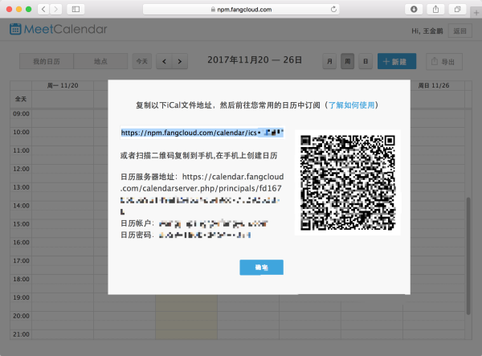

#### SOL日历（SolCalendar）

* 下载地址

  > 1. Google Play
  > 2. 豌豆荚
  > 3. [fir下载版本](http://fir.im/qr8c)

* 使用方式
  
1. 打开SolCalendar，点击右上角的【设置】按钮

	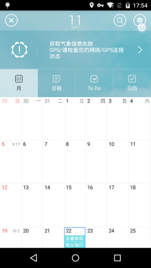

2. 在设置中选择【添加其他日历账户】

	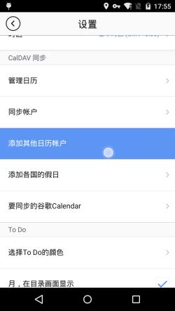

3. 再选择【用户自定义】

	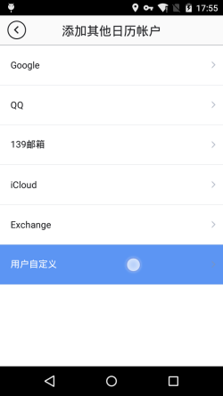

4. 在弹出的对话框中输入 `第一张图`获得的**日历服务器地址**、**日历账户**、**日历密码**

	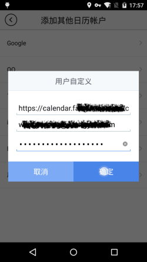

5. 点击确定会跳出【同步账户】，此处可以设置同步的参数

	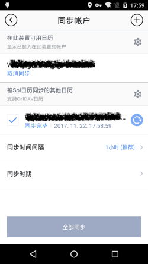

6. 在SolCalendar的日历页面即可看到会议邀请等遇见日历的内容

	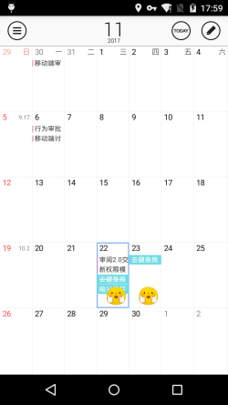

####DAVdroid

* 下载地址

  > 1. Google Play 有付费版本（官方版）
  > 2. [fir可下载版本](http://fir.im/753l)（我们自己编译的，如果遇到各种弹框，点击取消即可）

* 使用方法

1. 打开DAVdroid，点击右下角【加号】

	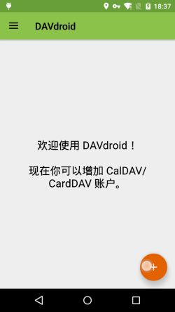
2. 跳转到【增加账户】页面，选择【使用URL和用户登录】，并输入`第一张图`获得的**日历服务器地址**、**日历账户**、**日历密码**
	
	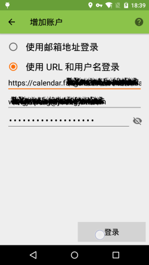
3. 点击【登录】—> 【创建账户】

	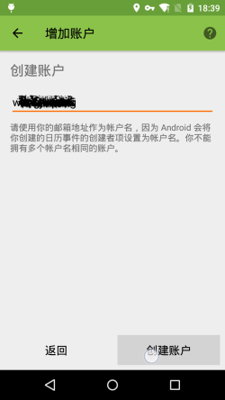
4. 回到首页，点击刚才创建的账户进入查看详情

	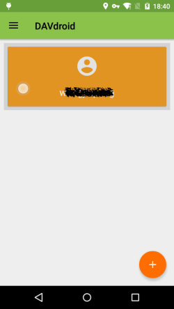
5. 在要同步的条目前打钩

	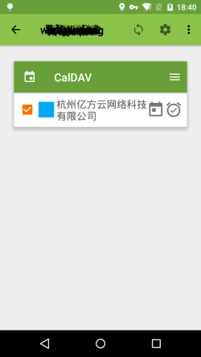

#### 最后

* 经过上面两种设置，你都可以切换回自己喜欢的日历应用中去查看
	
	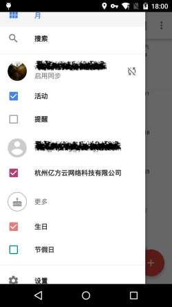

