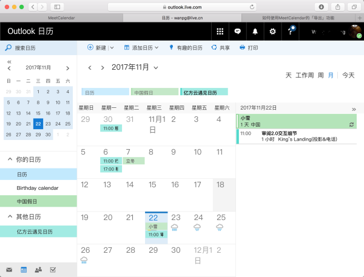

## 【遇见日历】账号同步-Outlook订阅

* 本文主要讲 【遇见日历】通过Outlook日历订阅在Android手机上实现日历展示和提醒的功能
* 当然Google账号也可以同步，鉴于需要翻墙等操作，此处不做详解，可以查看[这里进行日历订阅](https://npm.fangcloud.com/assets/calendar/html/help.html)

#### 账号同步

`导入Mocrosoft outlook` 和 `导入Google calendar`如果希望能在手机的日历显示和提醒需要使用到Android的账号同步系统。先讲下Android的账号同步怎么使用。

步骤如下

> 1. 在手机中的【设置】中找到【账户】并选择【添加账户】
> 2. 选择【电子邮箱】`部分手机名字可能【公司】-华为，【Microsoft Exchange ActiveSync】-三星`
> 3. 从【电子邮箱】进来的输入账号后要选择`EXCHANGE`协议
> 4. 【服务器设置】输入`eas.outlook.com`，部分手机可能会出现`证书不可用`的错误提示，此时将【安全类型】设置为` SSL/TLS（接受所有证书）`
> 5. 点击下一步即可，这种方式除了可以同步日历，还支持通讯录和邮件，有这个账号可以实现多手机的通讯录同步了

#### Outlook日历订阅

> 下面我们在电脑端操作OutLook订阅遇见日历

1. 打开遇见日历页面，选择【导出】（图2），将弹框中的地址（图3）复制 

	

2. 打开[outlook.com](outlook.com)，并登陆自己的outlook账号

   找到Outlook日历，并选择【添加日历】—> 【从Internet】
   
   

3. 将第1步中ICal文件地址复制填入下面的【链接到日历】
	
	

4. 点击保存即可得到下面的页面，可以看到亿方云的日历

	

#### 手机端日历效果

我们以Google日历应用来看效果，大部分日历应用基本都是一个套路

> 1. 手机端选择【日历】应用
> 2. 进入后点击设置查看 【显示的日历】
> 3. 将刚才设置的 `亿方云遇见日历`打钩，此时就可以在日历视图中看到我的会议提醒

